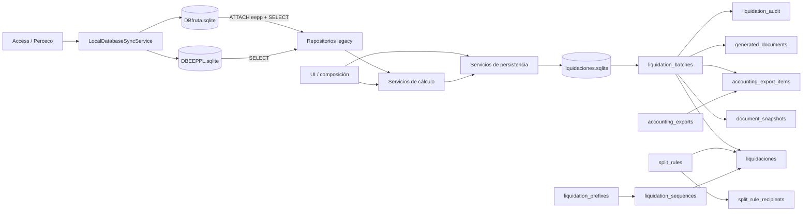

# Fase 0 — inventario SQLite y diseño de la migración a PostgreSQL

**Estado:** análisis estático del repositorio, 28-07-2026.
**Alcance:** `Remesas`; no se ha cambiado código, configuración, esquema ni datos.
**Decisión:** SQLite continúa siendo el backend de producción durante esta fase.

## 1. Alcance y límites de la inspección

El repositorio no contiene los ficheros de datos desplegados. Por ello, el esquema de la
persistencia propia se ha reconstruido de las 13 migraciones versionadas y sus pruebas; el
de las réplicas se ha inferido de las consultas. Antes de diseñar DDL definitivo se debe
ejecutar, **sobre copias**, `sqlite_master`, `PRAGMA table_info`, `PRAGMA index_list`,
`PRAGMA index_info`, `PRAGMA foreign_key_list` y `PRAGMA trigger_list` (o consulta de
triggers en `sqlite_master`). Las columnas legacy marcadas como opcionales se descubren
en ejecución y no pueden darse por confirmadas desde Git.

No se accedió a `192.168.1.3`, no se leyó `POSTGRES_PASSWORD` y no se migró ningún dato.

## 2. Bases SQLite y separación de responsabilidades

| Base | Ruta configurada | Clase | Finalidad | Escritura de la aplicación |
|---|---|---|---|---|
| `liquidaciones.sqlite` | `C:\Liquidaciones\datos\liquidaciones.sqlite` | Persistencia propia | batches, líneas, documentos, snapshots, exportaciones, rectificaciones, reglas, prefijos, secuencias y auditoría | Sí |
| `DBfruta.sqlite` | copia local desde `\\personal\C\BasesSQLite\DBfruta.sqlite` | Réplica Access/Perceco | entregas, remesas, costes y bonificaciones | No; URI `mode=ro` y `query_only` |
| `DBEEPPL.sqlite` | copia local desde `\\personal\C\BasesSQLite\DBEEPPL.sqlite` | Réplica Access/Perceco | socios, parcelas, expedientes, variedades, niveles y liquidaciones históricas | No; adjunta como `eepp` o abierta en lectura |
| SQLite temporales/en memoria | sólo pruebas | Fixtures | validación aislada | Sí, sólo tests |

`DBfruta` y `DBEEPPL` se copian al inicio mediante fichero temporal, validación
`PRAGMA quick_check`, comprobación de tablas y reemplazo atómico; puede conservarse backup,
se registra `sync_metadata.json` y se acepta la copia local anterior como fallback. Se avisa
si el origen tiene `-wal`, porque copiar únicamente el fichero principal puede producir una
instantánea incompleta. No existe sincronización bidireccional.

## 3. Archivos que dependen de SQLite

### Infraestructura y persistencia propia

* `data/persistence/database.py`: factoría por operación/hilo, WAL, timeout, claves foráneas,
  función SQL `NORMALIZE_SEARCH_TEXT` e inicialización.
* `data/persistence/migrations.py`: DDL y migraciones SQLite 1–13.
* `data/persistence/liquidation_repository.py`: todas las lecturas/escrituras funcionales de
  batches, líneas, documentos, snapshots y exportaciones.
* `data/persistence/master_repository.py`: prefijos y reglas de división.
* `services/liquidation_persistence_service.py`: transacción de alta, IdLiq, sustituciones,
  snapshots y auditoría.
* `services/liquidation_modification_service.py`: reversos, reemplazos y anulaciones.
* `services/liquidation_split_service.py`, `services/variety_group_migration_service.py`:
  consultas/actualizaciones directas sobre la conexión SQLite.
* `ui/remesas_frame.py` y `scripts/diagnose_duplicate_liquidations.py`: composición concreta
  de `PersistenceDatabase`/`LiquidationRepository`; la UI contiene además una consulta directa.

### Réplicas legacy de sólo lectura

`data/db_connection.py`, `deliveries_repository.py`, `excluded_member_repository.py`,
`fiscal_regime_repository.py`, `globalgap_repository.py`, `group_benchmark_repository.py`,
`hectare_fee_master_repository.py`, `hectare_repository.py`,
`legacy_persistence_repository.py`, `metadata_repository.py`, `quality_repository.py`,
`remesas_repository.py`, `variety_repository.py` y
`services/hectare_fee_report_service.py`. `services/local_database_sync_service.py` abre y
valida las réplicas. Los tests SQLite son deliberadamente numerosos y deberán mantenerse
para comprobar compatibilidad durante el modo dual.

## 4. Esquema real reconstruido de la persistencia propia

Tipos indicados son los declarados por SQLite. `PK` = clave primaria, `FK` = foránea,
`UQ` = única. No hay triggers declarados.

* **`schema_migrations`**: `version INTEGER PK`, `name TEXT NOT NULL`,
  `applied_at TEXT NOT NULL`.
* **`liquidation_prefixes`**: `crop TEXT PK`, `prefix TEXT NOT NULL UQ`,
  `active INTEGER NOT NULL DEFAULT 1 CHECK (0,1)`, `description TEXT`, `created_at TEXT`,
  `updated_at TEXT`.
* **`liquidation_sequences`**: `crop TEXT`, `campaign TEXT`, `company TEXT` (PK compuesta),
  `prefix TEXT`, `last_sequence INTEGER`, `initialized_from TEXT`, `legacy_last_idliq TEXT`,
  `initialized_at TEXT`, `updated_at TEXT`; todos `NOT NULL` salvo `legacy_last_idliq`.
* **`split_rules`**: `id INTEGER PK AUTOINCREMENT`, `source_member_id INTEGER NOT NULL`,
  `source_member_name TEXT`, `split_type TEXT NOT NULL`, `campaign TEXT`, `crop TEXT`,
  `variety TEXT`, `remittance_id INTEGER`, `effective_from TEXT`, `effective_to TEXT`,
  `active INTEGER NOT NULL DEFAULT 1`, `priority INTEGER NOT NULL DEFAULT 100`, `notes TEXT`,
  `source TEXT`, `created_at TEXT NOT NULL`, `updated_at TEXT NOT NULL`.
* **`split_rule_recipients`**: `id INTEGER PK AUTOINCREMENT`, `rule_id INTEGER NOT NULL FK
  split_rules(id) ON DELETE CASCADE`, `recipient_member_id INTEGER NOT NULL`,
  `recipient_member_name TEXT`, `value TEXT NOT NULL`, `is_residual INTEGER NOT NULL DEFAULT 0`,
  `sort_order INTEGER NOT NULL DEFAULT 0`, `active INTEGER NOT NULL DEFAULT 1`.
* **`liquidation_batches`**: `batch_id TEXT PK`, `remesa_id INTEGER NOT NULL`,
  `remesa_name TEXT NOT NULL`, `campaign/company/crop TEXT NOT NULL`, `payment_date TEXT`,
  `calculation_fingerprint TEXT NOT NULL`, `original_line_count/final_line_count INTEGER NOT NULL`,
  `status TEXT NOT NULL`, `created_at TEXT NOT NULL`, `created_by TEXT`, `voided_at/by/reason TEXT`,
  `operation_type TEXT NOT NULL DEFAULT 'ORIGINAL'`, `original_batch_id TEXT FK` y
  `replacement_batch_id TEXT FK` (ambas a batches), `modification_group_id TEXT`,
  `supersedes_batch_id TEXT FK`, `modification_reason TEXT`.
* **`liquidaciones`**: `id INTEGER PK AUTOINCREMENT`, `id_liq TEXT NOT NULL UQ`,
  `fecha/cultivo/campana/empresa TEXT NOT NULL`, `id_socio INTEGER NOT NULL`,
  `socio TEXT NOT NULL`, `cod_art TEXT`, `variedad TEXT NOT NULL`, importes decimales
  `neto`, `imp_bruto`, `recoleccion`, `cuota_ha`, `bp_calidad`, `b_transporte`, `b_global`,
  `base_i`, `iva`, `retencion`, `importe_total` como `TEXT NOT NULL`, y `precio_comer`,
  `precio_medio` como `TEXT` nullable; `id_concepto_liq INTEGER NOT NULL`,
  `concepto_liq/tipo TEXT NOT NULL`, `remesa_id INTEGER`, `source_member_id` y
  `recipient_member_id INTEGER NOT NULL`, `source_member_name/source_variety TEXT`,
  `source_liquidation_key TEXT NOT NULL`, `split_rule_id INTEGER FK split_rules`,
  `split_type TEXT`, `split_factor TEXT NOT NULL DEFAULT '1'`, `is_split INTEGER NOT NULL DEFAULT 0`,
  `batch_id TEXT FK liquidation_batches`, `status TEXT NOT NULL DEFAULT 'ACTIVE'`,
  `created_at TEXT NOT NULL`, `created_by TEXT`, `calculation_fingerprint TEXT`,
  `voided_at/by/reason TEXT`, `operation_type TEXT NOT NULL DEFAULT 'ORIGINAL'`,
  `original_batch_id`, `original_id_liq`, `replacement_batch_id`, `replacement_id_liq`,
  `modification_group_id`, `variety_code/name/group_code/group_name TEXT`.
* **`liquidation_audit`**: `id INTEGER PK AUTOINCREMENT`, `batch_id TEXT`,
  `action TEXT NOT NULL`, `entity_type/entity_id/details_json TEXT`, `created_at TEXT NOT NULL`,
  `created_by TEXT`. No FK formal a batch.
* **`legacy_imports`**: `name TEXT PK`, `imported_at TEXT NOT NULL`, `details TEXT`.
* **`generated_documents`**: `id INTEGER PK AUTOINCREMENT`, `batch_id TEXT NOT NULL FK`,
  `remittance_id/recipient_member_id INTEGER NOT NULL`, `document_type/file_path/status TEXT NOT NULL`,
  `generated_at/error_message TEXT`, `generation_attempt INTEGER NOT NULL DEFAULT 1`,
  `file_hash/created_by/benchmark_source_fingerprint TEXT`.
* **`exported_draft_documents`**: `id INTEGER PK AUTOINCREMENT`, `remittance_id` y
  `recipient_member_id INTEGER`, `member_name TEXT NOT NULL DEFAULT ''`, `campaign/crop TEXT NOT NULL`,
  `remittance_name TEXT NOT NULL DEFAULT ''`, `file_path TEXT NOT NULL`,
  `status TEXT NOT NULL DEFAULT 'GENERATED'`, `generated_at TEXT NOT NULL`,
  `source TEXT NOT NULL DEFAULT 'MANUAL_DRAFT_EXPORT'`, `company TEXT NOT NULL DEFAULT ''`,
  `file_hash TEXT`.
* **`accounting_exports`**: `id INTEGER PK AUTOINCREMENT`, `batch_id`,
  `modification_group_id`, `remittance_id`, `member_id`, `info_file_path`, `net_total`,
  `amount_total`, `file_hash`, `source_fingerprint`, `generated_at`, `created_by`, `error_message`,
  `batch_ids_json` nullable; `export_type/file_path/status/created_at TEXT NOT NULL`,
  `line_count/excluded_line_count INTEGER NOT NULL DEFAULT 0`,
  `generation_attempt INTEGER NOT NULL DEFAULT 1`, `supersedes_export_id INTEGER`. No FKs formales.
* **`accounting_export_items`**: `id INTEGER PK AUTOINCREMENT`, `export_id INTEGER NOT NULL FK`,
  `batch_id TEXT NOT NULL FK`, `liquidation_id INTEGER FK`, `recipient_member_id INTEGER`,
  `operation_type TEXT`, `created_at TEXT NOT NULL`, `UNIQUE(export_id, liquidation_id)`.
* **`liquidation_document_snapshots`**: `batch_id TEXT NOT NULL FK`,
  `recipient_member_id INTEGER NOT NULL` (PK compuesta), `payload_json TEXT NOT NULL`,
  `schema_version INTEGER NOT NULL`, `calculation_fingerprint TEXT NOT NULL`,
  `created_at TEXT NOT NULL`, `created_by TEXT`.

### Índices

Además de PK/UQ automáticos: `uq_active_batch_fingerprint` parcial; `ux_liquidation_active_scope`
parcial; índices de batches por `modification_group_id` y `supersedes_batch_id`; líneas por
contexto, socio, remesa, socio origen/destino, estado, clave origen, grupo de modificación,
IdLiq original y alcance benchmark; documentos por batch/estado y fingerprints; borradores por
contexto; exportaciones por alcance/fingerprint/tipo; e items por export, batch, liquidación y
destinatario. No existen índices explícitos para las FKs `split_rule_recipients.rule_id` ni para
algunas relaciones de rectificación.

## 5. Relaciones y diagrama de dependencias

Las relaciones formales son las descritas como FK en §4. Son relaciones sólo lógicas:
`liquidation_audit.batch_id`, `accounting_exports.batch_id/supersedes_export_id`, referencias
de rectificación de `liquidaciones`, `liquidation_sequences.prefix → liquidation_prefixes`, y
los IDs de socio/remesa/artículo hacia legacy. PostgreSQL debe formalizar las internas sin crear
FKs frágiles directamente hacia esquemas `legacy_*`.

## 6. Tablas legacy observadas y lecturas

| Origen | Tablas/columnas observadas | Uso |
|---|---|---|
| DBfruta | `PesosFres` (`CAMPAÑA`, `EMPRESA`, `CULTIVO`, `Fcarga`, `Reg`, `IdSocio`, `Variedad`, `Categoria`, `Neto`, `NetoPartida`, `Albaran`, `Boleta`, `Plataforma`, `Liquidado`; opcionales `Precalibrado`, `Cal0..Cal11`, `DesLinea`, `DesMesa`, `Podrido`; costes `Coste_Recoleccion`, `SSocialRecoleccion`, `Manijeria`, `Coste_Trans`) | Entregas, filtros, kilos, costes, cuota/ha |
| DBfruta | `PagosCIT` (`IdREMESA` y columnas detectadas dinámicamente) | cabecera y selección de remesas |
| DBfruta | `BonCalidad`, `BonGlobal` | bonificaciones de calidad/GlobalGAP |
| DBEEPPL | `DSocio` (`IdSocio`, nombres alternativos, `FacSoc`, opcional `Tipo`) | nombre, autofactura, exclusión socio 0/OTROS |
| DBEEPPL | `DEEPP` (`CAMPAÑA`, `EMPRESA`, `CULTIVO`, `Variedad`, `Boleta`, `IdPM`, `CHA`, certificación/nivel según consulta) | expedientes, superficies, certificación |
| DBEEPPL | `DParcela` (`Boleta`, contexto, `SupCul`, baja/año y campos de parcela) | superficie productiva |
| DBEEPPL | `MVariedad` (`CULTIVO`, `Variedad`, `GRUPO`, `SUBGRUPO`, `ARTICULO`) | variedades, grupos, artículos |
| DBEEPPL | `MNivelGlobal` (`Nivel`, `Indice`) | índice GlobalGAP |
| DBEEPPL | `DLiquidaciones` (`IdLiq`) | máximo histórico al inicializar secuencias |
| DBEEPPL | `DDividirLiq` (`SELECT *`) | importación histórica de divisiones |

Todas son consultas `SELECT`, con agregaciones, joins, subconsultas y descubrimiento de columnas.
No hay escritura a réplicas ni Access. El inventario exacto de columnas de `PagosCIT`,
`BonCalidad`, `BonGlobal`, `DEEPP`, `DParcela` y `DDividirLiq` queda como control previo obligado.

## 7. Escrituras y transacciones actuales

* Las migraciones y operaciones críticas usan `BEGIN IMMEDIATE`, `commit` y `rollback`.
* Guardar una remesa inserta batch, asigna todos los IdLiq, inserta líneas y snapshots/auditoría
  en una transacción; los documentos se generan tras el commit. Un lote de varias remesas usa
  **una transacción por remesa**, por diseño de recuperación parcial.
* Sustitución cambia batch/líneas/documentos anteriores y crea el reemplazo dentro de la misma
  conexión. Rectificación crea reverso/reemplazo y auditoría. Debe verificarse que todos los
  caminos públicos envuelven la cadena completa en una única transacción.
* Prefijos/reglas realizan CRUD; guardar una regla reemplaza destinatarios transaccionalmente.
* Registrar documentos, borradores y exportaciones son escrituras posteriores al guardado. No
  hay una transacción distribuida con filesystem: un PDF/CSV y su registro pueden divergir.
* `Decimal` se serializa como texto canónico; JSON se almacena como texto; booleanos como 0/1.

## 8. Dependencias/incompatibilidades SQLite → PostgreSQL

1. Placeholders `?`, `sqlite3.Row`, `connection.execute` y `lastrowid` requieren adaptación
   (`%s`, row factory Psycopg, cursor y `RETURNING`).
2. `BEGIN IMMEDIATE`, `PRAGMA foreign_keys/journal_mode/busy_timeout/synchronous/query_only`,
   `ATTACH DATABASE`, `sqlite_master` y los PRAGMA de metadatos no existen igual en PostgreSQL.
3. `INSERT OR REPLACE` en snapshots elimina/reinserta semánticamente; debe ser
   `ON CONFLICT (...) DO UPDATE`. `INSERT OR IGNORE` de prefijos será `DO NOTHING`.
4. `AUTOINCREMENT` debe ser identity; debe ajustar las identities tras importar IDs históricos.
5. La migración que reconstruye una tabla por afinidad SQLite no se traslada literalmente.
6. `date(substr(Fcarga,1,10))`, comillas dobles usadas como cadena vacía en alguna consulta,
   `CAST(... AS TEXT)` y comparaciones flexibles número/texto necesitan SQL tipado y revisión.
7. `NORMALIZE_SEARCH_TEXT` es una función Python registrada en SQLite; sustituir por expresión
   PostgreSQL estable (p. ej. `unaccent` autorizada + `lower`) o columna normalizada/indexada.
8. `LIKE` para IdLiq y JSON/texto (`details_json`, `payload_json`, `batch_ids_json`) deben
   mapearse con semántica explícita (`jsonb`, operadores JSON, escape de patrones).
9. SQL dinámico de nombres de tabla/columna no puede interpolarse sin allowlist/`Identifier`.
10. `ON CONFLICT` ya aparece y es portable sólo tras cambiar placeholders y confirmar el índice
    objetivo; `MAX`, `COUNT`, `COALESCE`, `TRIM`, `UPPER`, joins y CTEs son mayormente portables.

## 9. Riesgos de integridad y concurrencia

* WAL permite lectores concurrentes pero SQLite mantiene un solo escritor; `busy_timeout=30s`
  sólo espera, no aporta escalado multiusuario y una ruta local por puesto fragmenta la verdad.
* IdLiq se calcula leyendo/incrementando `liquidation_sequences`; `BEGIN IMMEDIATE` lo serializa
  en un fichero, pero PostgreSQL necesitará `SELECT ... FOR UPDATE`/UPSERT atómico. La
  inicialización además consulta el máximo legacy y líneas locales: dos puestos independientes
  pueden producir el mismo número.
* El check previo de batch vigente es vulnerable sin el índice parcial. La migración 13 lo crea,
  pero puede quedar pendiente si detecta duplicados; esto debe bloquear el corte.
* Faltan `CHECK` para estados, tipos de operación/división/documento/exportación, decimales,
  porcentajes, socio 0, conteos y relaciones válidas original–reverso–reemplazo.
* Varias referencias son sólo texto y admiten huérfanos. `accounting_export_items` no declara
  `ON DELETE`; en PostgreSQL se recomienda impedir borrado funcional y usar estados.
* `UNIQUE(export_id, liquidation_id)` permite múltiples NULL; decidir si un item de batch sin
  liquidación debe ser único mediante índice parcial.
* La unicidad de snapshot ya está protegida. Falta una política inequívoca para documento vigente
  por batch/destinatario/tipo y para exportaciones idempotentes.
* No hay `save_operation_id`, `export_operation_id` ni `rectification_operation_id`; una caída tras
  commit deja resultado incierto y hoy invita a reintentar.
* Los ficheros de réplicas pueden renovarse mientras existen conexiones; compartir una conexión
  `sqlite3` entre hilos falla por defecto. Persistencia abre conexión propia por hilo, pero los
  repositorios legacy conservan una conexión inyectada y la UI debe confinarla al hilo propietario.

## 10. Necesidades y política offline

Hoy la copia local y su fallback permiten consultar y calcular sin red, y la persistencia local
permite guardar/exportar. En el destino central eso sería contabilidad divergente. Política propuesta:

* permitir arranque, consulta y cálculo no vinculante con caché legacy válida, mostrando antigüedad;
* **prohibir** alta, sustitución, rectificación y exportación contable sin confirmación central;
* permitir consultar PDFs/snapshots locales como histórico de sólo lectura;
* no implementar sincronización bidireccional en esta migración;
* ante desconexión posterior a un envío, consultar por UUID idempotente antes de ofrecer reintento.

## 11. Propuesta `liquidaciones` y mapeo de tipos

Mantener inicialmente nombres de tablas/columnas para reducir riesgo. Todas las tablas de §4,
incluidas auditoría funcional y `schema_migrations`, vivirán en `liquidaciones`; nada propio en
`public`, `integracion`, `informes`, `auditoria` o `legacy_*`.

| SQLite | PostgreSQL propuesto | Observación |
|---|---|---|
| PK `INTEGER AUTOINCREMENT` | `bigint GENERATED BY DEFAULT AS IDENTITY` | conservar ID durante carga y reajustar sequence |
| `batch_id`, grupos/modificación y nuevas operaciones UUID en `TEXT` | `uuid` | validar primero que todos los valores sean UUID |
| fechas de negocio (`fecha`, `payment_date`, vigencias) | `date` | confirmar valores reales |
| auditoría/generación/creación/anulación | `timestamptz` | normalizar a UTC |
| kilos (`neto`) | `numeric(18,4)` | validar escala real |
| importes/cuotas/bonificaciones/base/total | `numeric(18,6)` | nunca float |
| precios y factores | `numeric(18,10)` | porcentajes con CHECK razonable |
| JSON textual | `jsonb` | validar/normalizar antes de cast |
| flags 0/1 | `boolean` | rechazar otros valores |
| hashes | `varchar(64)` | CHECK de formato si SHA-256 confirmado |
| estados/tipos | `varchar` + `CHECK` | preferible a enum en primera etapa reversible |
| rutas/errores/nombres | `text` | no asumir longitudes sin perfilado |
| campaña/empresa/cultivo/remesa | conservar nombre y tipo compatible | no renombrar a `remittance_id` aún |

Añadir FKs internas faltantes, checks, `recipient_member_id/source_member_id <> 0`, unicidad parcial
del alcance vigente adaptada a los estados reales, y coherencia de rectificación. No crear FK a
legacy. La secuencia IdLiq debe ser una tabla contador con PK `(crop,campaign,company)`, fila
bloqueada y función transaccional que inicialice una sola vez; conserva prefijo/campaña/empresa y
cuatro dígitos. Un `UNIQUE(id_liq)` sigue siendo la última defensa.

Roles previstos: `liquidaciones_owner` (DDL/migraciones), `liquidaciones_app` (DML y uso de
identities) y `liquidaciones_readonly` (SELECT). Si no pueden crearse, `perceco_engine` sólo de
forma temporal y con grants mínimos. Los futuros scripts serán `001_roles.sql`, `002_schema.sql`
y `003_permissions.sql`, sin contraseñas.

## 12. Vistas propuestas en `integracion` e informes

Primero cotejar catálogo/columnas reales del servidor; luego publicar contratos estables:

* `integracion.socios(member_id, member_name, self_billed, active, member_type)` desde
  `legacy_eepp.DSocio`; reemplaza especialmente `FacSoc` y exclusiones.
* `integracion.entregas` desde `legacy_dbfruta.PesosFres`, tipando fecha y económicos.
* `integracion.remesas` desde `legacy_dbfruta.PagosCIT`.
* `integracion.expedientes`, `integracion.parcelas`, `integracion.variedades`,
  `integracion.niveles_global`, `integracion.liquidaciones_historicas` desde `legacy_eepp`.
* `integracion.bonificaciones_calidad` y `integracion.bonificaciones_global` desde
  `legacy_dbfruta`.

Consultas agregadas costosas deben exponerse en `informes`: superficies por socio/grupo, benchmark
varietal, cuota/ha por boleta, entregas por campaña y liquidaciones exportadas. La aplicación sólo
hará SELECT allí. Hasta validar equivalencia, las réplicas SQLite siguen disponibles.

## 13. Plan de migraciones e implementación

1. **Fase 0 (esta entrega):** capturar catálogos reales y perfilado de datos; aprobar mapeo.
2. Añadir `DatabaseSettings` (backend por defecto `sqlite`; secreto obligatorio sólo para
   `postgresql/dual`) y dependencias Psycopg 3; representación/logs siempre redactados.
3. Extraer `PersistenceDatabaseProtocol`, transacción uniforme y contratos de repositorio;
   renombrar implementaciones actuales a SQLite sin cambiar comportamiento.
4. Crear roles/esquema/permisos y runner PostgreSQL versionado con checksum y versión de app.
5. DDL por dependencias: migraciones/prefijos/reglas → batches → líneas → snapshots/documentos →
   exportaciones/items → auditoría/importaciones/secuencias. Aplicar constraints diferibles sólo
   si la carga histórica lo exige y validarlas antes del corte.
6. Crear comando explícito SQLite→PostgreSQL, nunca en startup, con `--dry-run`, esquema de test,
   checkpoints, informe JSON/CSV y una única transacción por ejecución o rollback controlado.
7. Implementar repositorios PostgreSQL y pruebas de Decimal, UUID, JSONB, fechas, RETURNING,
   conflictos, rollback, permisos, secuencia e idempotencia.
8. Modo dual temporal recomendado: SQLite sigue principal al comienzo y PostgreSQL recibe
   **escritura sombra post-commit**, registrando cualquier fallo; lecturas de historial/detalle/
   documentos/exportaciones/duplicados se comparan y se devuelve SQLite. Después de estabilizar,
   invertir principal/espejo durante una ventana corta. Nunca simular commit distribuido.
9. Pruebas concurrentes y de pérdida de conexión; corte a PostgreSQL; congelar SQLite como copia
   histórica de sólo lectura.
10. Sustituir consultas legacy por vistas `integracion`, después desactivar copia al inicio y sólo
    finalmente retirar SQLite.

Archivos que se modificarán en fases siguientes: `requirements.txt`, `data/db_connection.py`, toda
`data/persistence/`, los tres servicios que ejecutan SQL directo, composición en
`ui/remesas_frame.py`/`app.py`, indicador de UI, servicio CSV para `FacSoc`, sincronización local,
script diagnóstico y tests. Se añadirán módulos de settings, PostgreSQL, dual/shadow, CLI de
migración/validación, DDL versionado y pruebas de integración. No se deben hacer reemplazos SQL
globales ni duplicar reglas de negocio.

## 14. Validación, fingerprints y criterios de corte

Antes de copiar: backup SQLite consistente (incluido checkpoint WAL), catálogo completo, checks de
integridad y congelación identificada. Por tabla comparar:

* filas, PK mínima/máxima, nulos, UUID inválidos/duplicados, estados y huérfanos;
* cardinalidad por alcance y relaciones original/reverso/reemplazo;
* sumas Decimal de kilos, bruto, conceptos, base y total, agrupadas por batch/campaña/empresa;
* documentos, snapshots, exportaciones, items y rectificaciones, incluida unicidad lógica;
* JSON parseable y semánticamente igual; hashes/rutas sin exigir que el fichero siga accesible.

Fingerprint determinista: ordenar por PK estable; serializar una lista de nombres/valores con JSON
canónico UTF-8; Decimal sin exponente ni ceros ambiguos según escala acordada; UTC ISO-8601;
`null` explícito; JSON recursivamente ordenado; boolean real. SHA-256 por tabla y por batch, nunca
sobre el texto que devuelve cada motor. Emitir JSON y CSV con versión del algoritmo.

Pruebas imprescindibles: dos conexiones asignando IdLiq; dos altas del mismo alcance; remesas
distintas; sustitución y rectificación exportada; socio 0; snapshot/documento/export/items;
caída antes/después de commit; consulta por operación idempotente; permisos; lectura de
`integracion`; generación PDF/CSV fuera de transacción. El corte exige conteos, importes y
fingerprints conformes, backup/restore ensayado y discrepancias duales a cero durante la ventana.

## 15. Rollback y operación

* **Antes del corte:** rollback de la carga mediante transacción o eliminación exclusiva del
  esquema de prueba; SQLite no cambia y continúa principal.
* **Modo dual:** apagar sombra con `DATABASE_BACKEND=sqlite`; conservar cola/informe de
  discrepancias. Nunca copiar automáticamente cambios centrales de vuelta.
* **Corte:** ventana controlada, backup `pg_dump --format=custom --schema=liquidaciones`, copia
  consistente SQLite, informe firmado y versión de aplicación. Probar `pg_restore` en base temporal.
* **Después del corte:** rollback funcional sólo si se detienen escrituras y se demuestra que no
  existen operaciones exclusivas en PostgreSQL; en caso contrario, mantener central, corregir y
  restaurar. No promover una SQLite obsoleta.
* Contraseña exclusivamente en `POSTGRES_PASSWORD`; ningún DSN completo, secreto o payload personal
  en logs/errores. Registrar eventos de conexión, migración, validación, dual, offline y cambio de
  backend con identificadores y metadatos no sensibles.

## 16. Decisiones pendientes (bloquean DDL definitivo)

1. Exportar catálogos y perfilado de las tres SQLite desplegadas, incluidos triggers (se espera
   ninguno en la propia, pero debe verificarse).
2. Confirmar catálogo y permisos reales de `legacy_*`, `integracion`, `informes` y `auditoria`.
3. Acordar vocabularios completos de estados/tipos y precisión observada de cada decimal.
4. Decidir zona horaria de fechas sin offset, retención de auditoría y política de borrado.
5. Confirmar si una remesa puede tener varios batches vigentes legítimos por algún atributo no
   incluido hoy en el índice parcial.
6. Confirmar SLA offline y duración máxima del modo dual.

Hasta resolverlos no se debe crear el esquema funcional ni cambiar consultas legacy.

## Estado final de flujo productivo

Las referencias SQLite conservadas se limitan a pruebas y `db_tools/sqlite_migrator.py` (herramienta explícita de sólo lectura). El arranque normal usa `PostgresRepository`, los esquemas `legacy_*` y `liquidaciones`; no importa `LocalDatabaseSyncService` ni abre rutas SQLite. La inspección física y los conteos siguen pendientes porque el archivo fuente no está disponible en este entorno.
